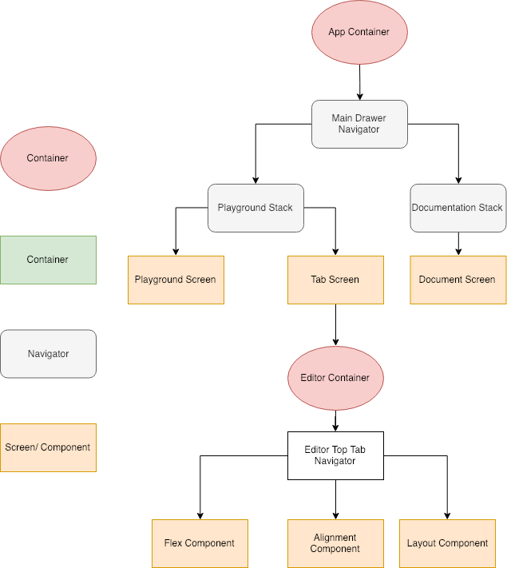
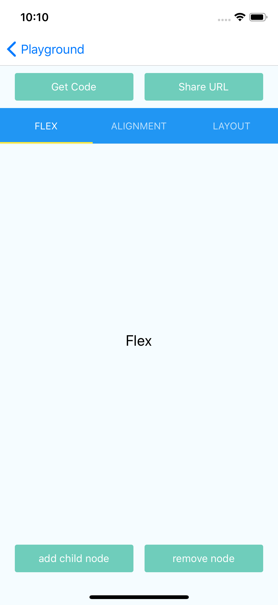

# flex-box-playground
## Step 1: Confix Router for App
* Design flow screen and configure route for them by React Navigation: App container, Drawer Menu, Stack navigator, Top TabBar Navigator. 

|   |   |   |
|---|---|---|
|| | |

## Step 2: UI
* Design flow screen and configure route for them by React Navigation: App container, Drawer Menu, Stack navigator, Top TabBar Navigator. 

|   |   |   |
|---|---|---|
|| | |

|   |   |   |
|---|---|---|
|| | |